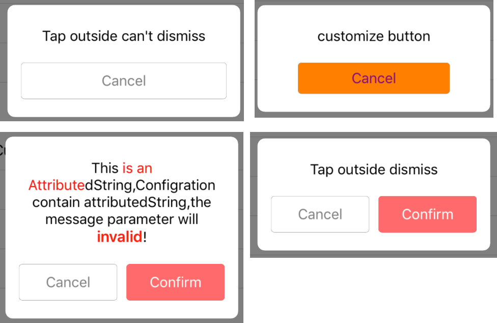

# BRAlertView

[](https://travis-ci.org/brant/BRAlertView)
[](http://cocoapods.org/pods/BRAlertView)
[](http://cocoapods.org/pods/BRAlertView)
[](http://cocoapods.org/pods/BRAlertView)

## Example

To run the example project, clone the repo, and run `pod install` from the Example directory first.



```
[BRTextAlertView showMessage:@"Tap outside can't dismiss" buttonTitles:@[@"Cancel"] configrationBlock:^BRTextConfigration * _Nullable{
    BRTextConfigration *configration = [BRTextConfigration new];
    configration.tapOutsideDismiss = NO;
    return configration;
} actionBlock:^(int index) {

}];

[BRTextAlertView showMessage:@"Tap outside dismiss" buttonTitles:@[@"Cancel", @"Confirm"] configrationBlock:^BRTextConfigration * _Nullable{
    BRTextConfigration *configration = [BRTextConfigration new];
    NSMutableAttributedString *attrString = [[NSMutableAttributedString alloc] initWithString:@"This is an AttributedString,Configration contain attributedString,the message parameter will invalid!"];
    [attrString addAttribute:NSForegroundColorAttributeName value:[UIColor redColor] range:NSMakeRange(4, 16)];
    NSRange range = [[attrString string] rangeOfString:@"invalid"];
    [attrString addAttribute:NSFontAttributeName value:[UIFont boldSystemFontOfSize:17] range:range];
    [attrString addAttribute:NSForegroundColorAttributeName value:[UIColor redColor] range:range];
    configration.attributedString = attrString;
                
    return configration;
} actionBlock:^(int index) {
                
}];
```

## Requirements

iOS 7.0 or higher

## Installation

BRAlertView is available through [CocoaPods](http://cocoapods.org). To install
it, simply add the following line to your Podfile:

```ruby
pod "BRAlertView"
```

## Author

brant, sjwu1234@gmail.com

## License

BRAlertView is available under the MIT license. See the LICENSE file for more info.
